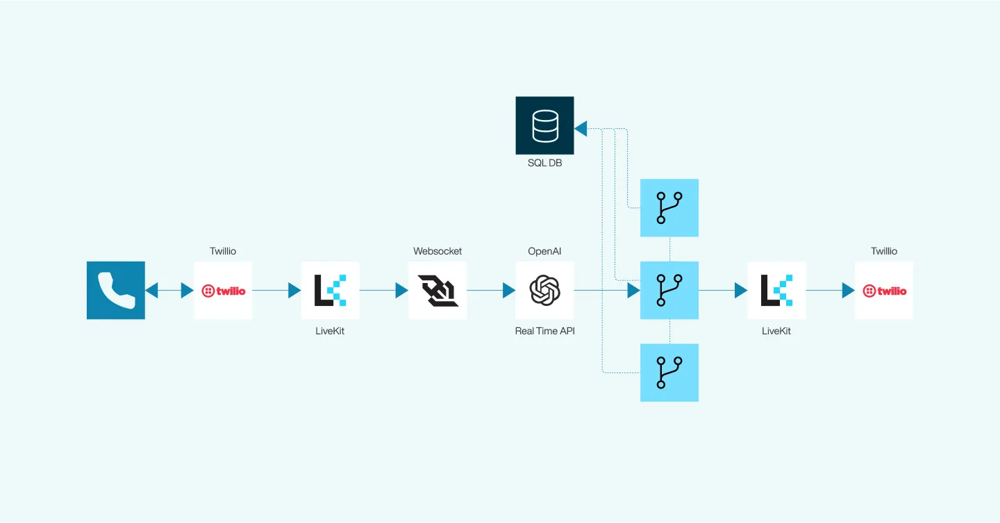
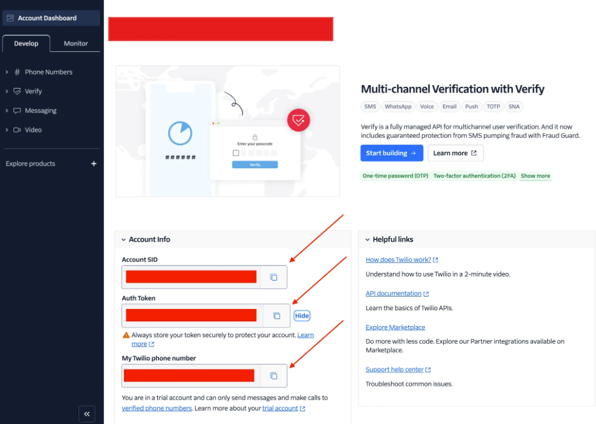
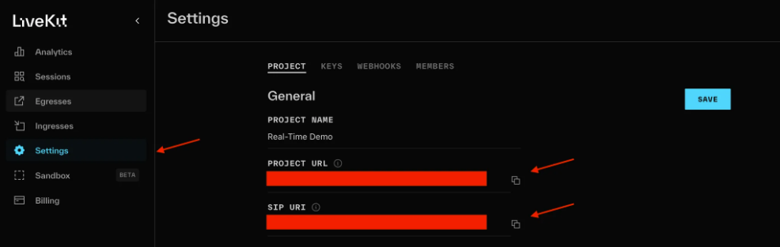
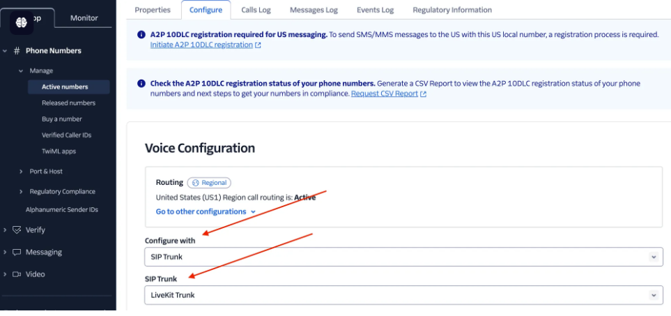

# How to Build Your Own AI-Powered Voice Agent with LiveKit and Twillio: Step-by-Step Implementation Guide

## Step 1: Create a Twilio Account

Start by signing up for a Twilio account if you haven’t already. Simply visit [Twilio’s website](https://www.twilio.com/) and follow the registration process to set up your account.

## Step 2: Create a Phone Number

Once your account is ready, navigate to the Twilio Console and create a phone number. You don’t need to configure any additional settings at this stage—just select a number and you’re good to go. This number will be used to handle incoming and outgoing calls in the later steps.

## Step 3: Get Your API Credentials from Twilio

Next, you’ll need your Twilio API credentials to integrate with LiveKit. These include your Account SID and Auth Token. Follow these steps:

1. Go to the Twilio Console.
2. Navigate to the Account Info section.
3. Copy your Account SID and Auth Token, and Twillio phone number —you’ll use these in the next steps.
   

## Step 4: Create a LiveKit Account and Project

1. Create a LiveKit Account

Sign up for a LiveKit account if you don’t have one already by visiting LiveKit’s website.

2. Create a Project

After signing up, log in and create a new project within LiveKit. This project will be used to handle real-time audio and video interactions.

3. Get the Project URL and SIP URI Parameters

Navigate to the Settings section of your newly created project and locate the Project URL and SIP URI parameters. These will be crucial in the later steps when configuring the integration.



## Step 5: Simplify Complex Settings with a Script

To streamline the configuration process for Twilio and LiveKit, use the pre-built script available at the following URL: Twilio & LiveKit Integration Script(scripts/create_inbound_trunk.py).

Here’s what you need to do:

1. Download or clone the script from the link above.

2. Replace the placeholders in the script with the necessary details:

- Account SID
- Auth Token
- Phone Number
- SIP URI (found in previous steps)

3. To ensure your environment is ready for Twilio, LiveKit, and OpenAI integration, install the necessary Python packages. Run the following command in your terminal:

```bash
pip install -r requirements.txt
```

4. Install the LiveKit SDK

If you’re using macOS, you can install the LiveKit CLI via Homebrew:

```bash
brew install livekit-cli # MacOS
winget install LiveKit.LiveKitCLI # Windows
curl -sSL https://get.livekit.io/cli | bash # Linux
```

5. Authenticate with LiveKit

After installation, authenticate to your LiveKit account by running the following command:

```bash
lk cloud auth
```

6. Run the script to automatically configure Twilio and LiveKit with the required settings, minimizing the manual setup process. It will automatically create a SIP Trunk in Twilio and make all required configurations.

This script will handle most of the heavy lifting, simplifying the integration between Twilio and LiveKit for real-time communication.



## Step 6: Log in to Twilio and Update Voice Configuration on SIP Trunk

After the script has automatically created the SIP Trunk on Twilio, you’ll need to manually update the Voice Configuration to ensure everything works correctly.

# Run Voice Agent

- OpenAI Realtime Voice AI Agent

```bash
python scripts/openai_realtime_voice_ai_agent.py
```

- Run Voice Pipeline AI Agent with Functional Calling and Saving chat message

```bash
python scripts/save_chatctx.py
```

# Useful livekit-cli commands

```
lk sip inbound list
lk sip inbound create inbound_trunk.json
lk sip inbound delete SIP_ID
```

# Preferences

https://docs.livekit.io/agents/overview/
https://docs.livekit.io/agents/quickstarts/voice-agent/

https://github.com/livekit/agents/tree/main/examples/voice-pipeline-agent/llamaindex-rag
https://github.com/lexiconlabsai/rag-saas

https://www.datavise.ai/blog/usage-of-realtime-openai-api-with-twillio-and-livekit
https://gist.github.com/ShayneP/51eabe243f9e7126929ea7e9db1dc683
